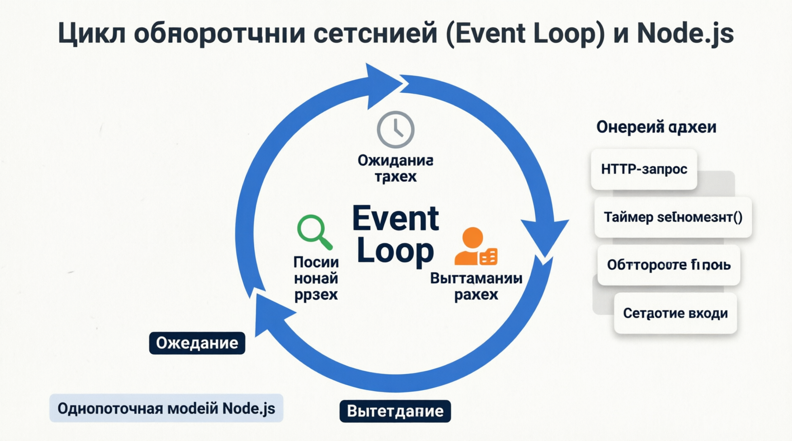
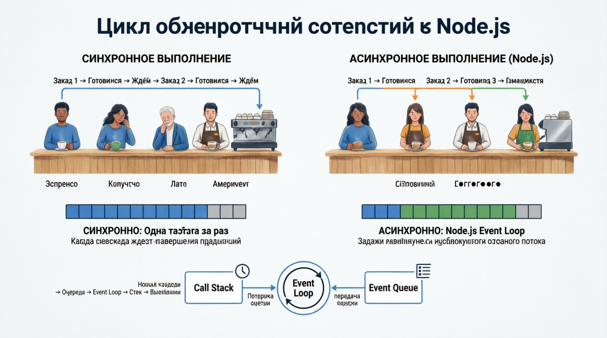
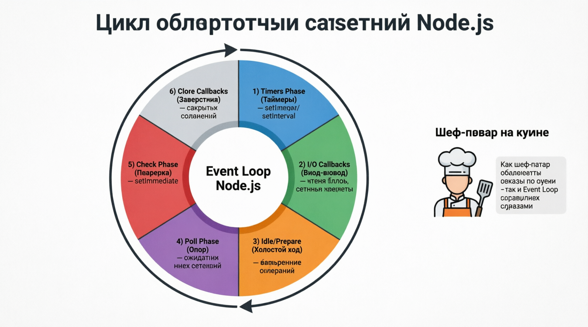
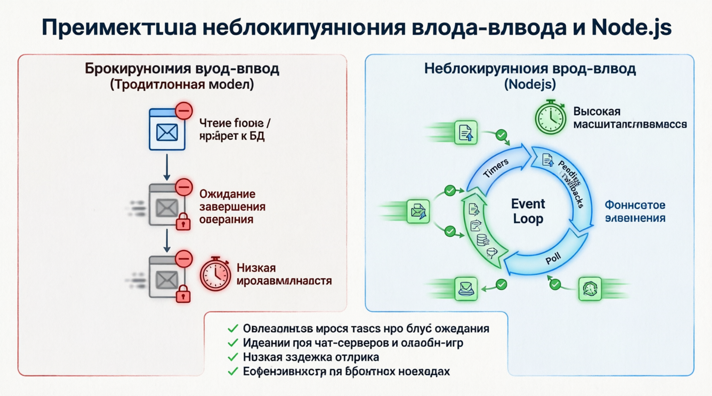

# The Event Loop
Цикл обработки событий - одна из самых фундаментальных и увлекательных концепций в Node.js, обеспечивающая его неблокирующий асинхронный характер. Чтобы в полной мере оценить его мощь и элегантность, давайте углубимся в цикл обработки событий, разберем его механику, этапы и принципы, которые делают его незаменимым для создания высокопроизводительных приложений.

## The Concept of the Event Loop
По своей сути, цикл обработки событий - это бесконечный цикл, который ожидает выполнения задач, выполняет их, а затем переходит в режим ожидания, пока не поступят новые задачи. Это похоже на прилежного работника, который постоянно проверяет, есть ли новые задания для выполнения, завершает их, а затем сразу же приступает к поиску следующей задачи. Этот непрерывный цикл позволяет Node.js эффективно выполнять множество задач без создания нескольких потоков.

## Понимание синхронного и асинхронного выполнения
Чтобы ПОНЯТЬ цикл обработки событий, важно понимать разницу между синхронным и асинхронным выполнением. Синхронное выполнение означает, что задачи выполняются одна за другой, и каждая задача должна ожидать завершения предыдущей. Представьте, что вы стоите в очереди в кофейне, где бариста готовит по одному заказу за раз; если кто-то заказывает сложный напиток, всем остальным приходится ждать.

Напротив, асинхронное выполнение позволяет запускать и продолжать выполнение задач, не дожидаясь завершения других. Это похоже на работу нескольких бариста в кофейне, каждый из которых обрабатывает разные заказы независимо, обеспечивая более быстрое обслуживание для всех. Node.js такое асинхронное поведение достигается с помощью цикла обработки событий, который эффективно обрабатывает задачи, не блокируя основной поток выполнения.

## Механика цикла обработки событий
ЦИКЛ ОБРАБОТКИ СОБЫТИЙ в node НЕПРЕРЫВНО проходит через ряд этапов, каждый из которых отвечает за различные типы операций. Давайте разберем эти этапы:

#### Timers Phase (Фаза таймеров):
Выполняет обратные вызовы, запланированные с помощью setTimeout и setInterval .
Если вы настроите таймер на срабатывание через определенный промежуток времени, обратный вызов, связанный с этим таймером, будет выполнен на этом этапе.

#### I/O Callbacks Phase (Фаза обратных вызовов ввода-вывода):
Выполняет обратные вызовы для завершенных операций ввода-вывода, таких как чтение из файла или сетевой запрос.
На этом этапе выполняется большинство асинхронных операций ввода-вывода, гарантируя, что приложение остается отзывчивым.

#### Idle, Prepare Phase (Холостой ход, фаза подготовки):
Внутренние операции Node.js, подготавливающие систему к предстоящим этапам.
С которыми разработчики обычно не взаимодействуют, но которые имеют решающее значение для функционирования цикла обработки событий.

#### Poll Phase (Фаза опроса):
Извлекает новые события ввода-вывода и выполняет их обратные вызовы.
На этапе опроса цикл обработки событий проводит большую часть своего времени, ожидая новых событий и обрабатывая их по мере поступления.

#### Check Phase (Фаза проверки):
Выполняет обратные вызовы, запланированные setImmediate .
Этот этап позволяет разработчикам запускать функции сразу после этапа опроса, гарантируя, что они будут выполнены как можно скорее.

#### Close Callbacks Phase (Завершение фазы обратных вызовов):
Выполняет обратные вызовы для закрытых соединений, например, при закрытии TCP-сокета.
Обеспечивает надлежащую очистку закрытых ресурсов и управление ими.

Цикл обработки событий в Node.js был вдохновлен моделью выполнения JavaScript в веб-браузерах. Райан Даль, создатель Node.js, понял, что та же модель может быть использована для эффективной обработки операций ввода-вывода на стороне сервера. Эта идея привела к разработке системы Node.js, позволяющей обрабатывать тысячи одновременных подключений с высокой производительностью. В некотором смысле, цикл обработки событий подобен шеф-повару на загруженной кухне, который умело справляется с несколькими заказами одновременно, даже не вспотев!

## Преимущества неблокирующего ввода-вывода
НЕ БЛОКИРУЮЩИЙ ввод-вывод ЯВЛЯЕТСЯ краеугольным камнем архитектуры Node.js. В традиционных моделях блокирующего ввода-вывода такие задачи, как чтение файла или запрос к базе данных, блокируют весь процесс до завершения операции. Такой подход может серьезно ограничить производительность и масштабируемость приложений, особенно при больших нагрузках.

Node.js ***неблокирующая модель*** ввода-вывода гарантирует, что эти операции выполняются в фоновом режиме, позволяя циклу обработки событий продолжать обработку других задач. Это особенно полезно для приложений реального времени, таких как чат-серверы или онлайн-игры, где скорость отклика и низкая задержка имеют решающее значение.

## Real-World Applications
ЭФФЕКТИВНОСТЬ ЦИКЛА ОБРАБОТКИ СОБЫТИЙ делает его Node.js идеальным выбором для широкого спектра реальных приложений:

#### Real-Time Chat Applications:
Чат-приложениям требуется обрабатывать множество одновременных подключений с минимальной задержкой. Способность event loop управлять множеством задач одновременно обеспечивает быструю и эффективную доставку сообщений.

#### Online Gaming:
Онлайн-игры должны обрабатывать действия нескольких игроков в режиме реального времени. Неблокирующий характер цикла обработки событий позволяет игровому серверу обрабатывать многочисленные события, такие как перемещения и взаимодействия игроков, без задержек.

#### Collaborative Tools:
Такие инструменты, как текстовые редакторы для совместной работы или приложения для управления проектами, извлекают выгоду из возможности event loop управлять обновлениями и уведомлениями в режиме реального времени, гарантируя, что все пользователи мгновенно увидят изменения.

#### Microservices Architecture:
Node.js Цикл обработки событий хорошо подходит для микросервисов, где каждая служба выполняет определенные задачи независимо. Способность цикла обработки событий эффективно управлять операциями, связанными с вводом-выводом, гарантирует оптимальную работу каждого микросервиса.

Цикл обработки событий - это бьющееся сердце Node.js, обеспечивающее его ***асинхронные, неблокирующие возможности***. Благодаря непрерывному циклическому выполнению различных этапов и эффективному управлению задачами цикл обработки событий гарантирует, что Node.js приложения остаются отзывчивыми и масштабируемыми. Понимание цикла обработки событий позволяет разработчикам писать эффективный код, который в полной мере использует преимущества платформы Node.js, что делает ее незаменимой концепцией для всех, кто работает с этой мощной платформой. Независимо от того, создаете ли вы приложение для общения в режиме реального времени, онлайн-игру или инструмент для совместной работы, цикл обработки событий - это ключ к раскрытию всего потенциала Node.js.