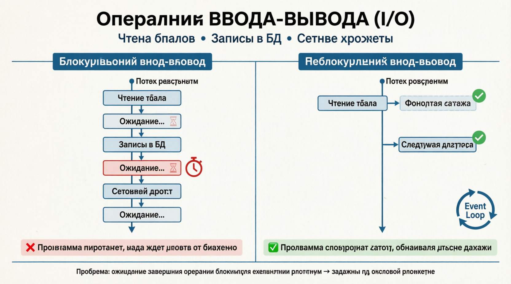
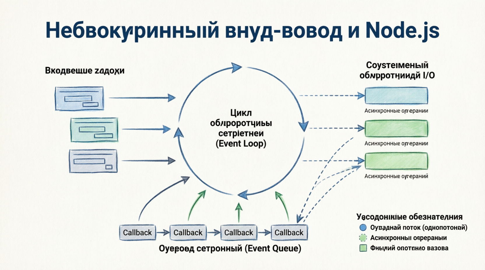
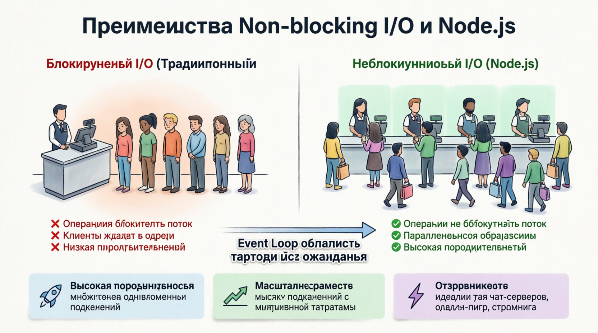

# Understanding Non-blocking I/O
БЛОКИРУЮЩИЙ ввод-вывод ЯВЛЯЕТСЯ краеугольным камнем разработки Node.js, позволяя ит-отделу выполнять несколько операций одновременно, не дожидаясь завершения одной, прежде чем запускать другую. Этот подход имеет решающее значение для создания высокопроизводительных масштабируемых приложений, особенно тех, которые требуют взаимодействия в режиме реального времени. Давайте углубимся в концепцию неблокирующего ввода-вывода, разберемся, как это работает, и рассмотрим ее значение в экосистеме Node.js.

## The Concept of I/O Operations
Операции ВВОДА-вывода (I/O) относятся к любой операции, которая включает ***передачу данных на периферийные устройства системы или с них, например, чтение из файла, запись в базу данных или выполнение сетевых запросов***. В традиционных моделях блокирующего ввода-вывода эти операции могут вызывать значительные задержки, поскольку программа должна ожидать завершения каждой операции, прежде чем переходить к следующей задаче. Такое ожидание может привести к неэффективности и ухудшению взаимодействия с пользователем, особенно в условиях высокой нагрузки.

## How Non-blocking I/O Works in Node.js
NODE.JS ДЛЯ достижения высокого уровня ***параллелизма*** используется неблокирующая модель ввода-вывода, управляемая СОБЫТИЯМИ. Вот как это работает:

#### Event Loop:
Node.js выполняется в однопоточном цикле обработки событий, который непрерывно проверяет и обрабатывает задачи из очереди событий.

Когда запускается асинхронная операция ввода-вывода, цикл обработки событий передает задачу системным обработчикам ввода-вывода и продолжает обрабатывать другие задачи.

#### Callback Functions:
Для каждой неблокирующей операции ввода-вывода предусмотрена функция обратного вызова. Эта функция выполняется после завершения операции ввода-вывода, гарантируя, что приложение сможет обрабатывать результаты операции, не блокируя основной поток.

#### Event Queue:
Завершенные операции ввода-вывода и их обратные вызовы помещаются обратно в очередь событий. Цикл обработки событий обрабатывает эти обратные вызовы по мере их поступления, выполняя их для обработки результатов операций ввода-вывода.

## Benefits of Non-blocking I/O

#### High Performance:
Не БЛОКИРУЕМЫЙ ввод-вывод ПОЗВОЛЯЕТ Node.js эффективно обрабатывать множество одновременных подключений. Не дожидаясь завершения операций ввода-вывода, цикл обработки событий может обрабатывать другие задачи, что делает приложение очень отзывчивым и производительным.

#### Scalability:
Неблокирующий ввод-вывод имеет решающее значение для создания ***масштабируемых*** приложений. Node.js позволяет управлять тысячами одновременных подключений с минимальными затратами, что делает его идеальным для приложений реального времени, таких как чат-серверы, онлайн-игры и инструменты для совместной работы.

Неблокирующий ввод-вывод - это все равно что обладать ***сверхспособностями для многозадачности***. Традиционный блокирующий ввод-вывод сродни работе одного кассира с длинной очередью клиентов, по одному за раз. Напротив, неблокирующий ввод-вывод - это все равно что иметь целый парк кассиров, обслуживающих нескольких клиентов одновременно, гарантируя, что никому не придется ждать слишком долго. Именно благодаря такому подходу Node.js он может эффективно справляться с большими рабочими нагрузками, что делает его идеальным выбором для приложений реального времени, таких как чат-серверы и сервисы прямой трансляции.

## Real-world Applications of Non-blocking I/O

#### Real-time Applications:
Такие приложения, как чат-серверы и онлайн-игры, значительно выигрывают от неблокирующего ввода-вывода. Эти приложения требуют низкой задержки и высокой пропускной способности, что обеспечивает неблокирующая модель Node.js.

#### API Servers:
Node.js широко используется для создания RESTful API. Неблокирующий ввод-вывод гарантирует, что серверы API могут обрабатывать множество запросов одновременно, обеспечивая быстрые и эффективные ответы.

#### Data Streaming:
Неблокирующий ввод-вывод идеально подходит для приложений, связанных с потоковой передачей данных, таких как сервисы потоковой передачи видео. Node.js позволяет эффективно передавать данные без буферизации всего содержимого, сокращая задержку и использование памяти.

#### Microservices:
В архитектуре микросервисов службам часто требуется взаимодействовать друг с другом по сети. Неблокирующий ввод-вывод позволяет Node.js эффективно управлять этими взаимодействиями, гарантируя, что службы остаются отзывчивыми и масштабируемыми.

Неблокирующий ввод-вывод - это мощная функция, которая отличает Node.js от традиционных серверных технологий. Позволяя выполнять операции ввода-вывода асинхронно, Node.js можно добиться высокой производительности, масштабируемости и эффективности использования ресурсов. Понимание и использование неблокирующего ввода-вывода имеет важное значение для создания надежных приложений реального времени, способных удовлетворить требования современной веб-разработки. Разрабатываете ли вы чат-сервер, API или службу потоковой передачи данных, модель неблокирующего ввода-вывода Node.js обеспечивает основу для создания высокочувствительных и масштабируемых приложений.