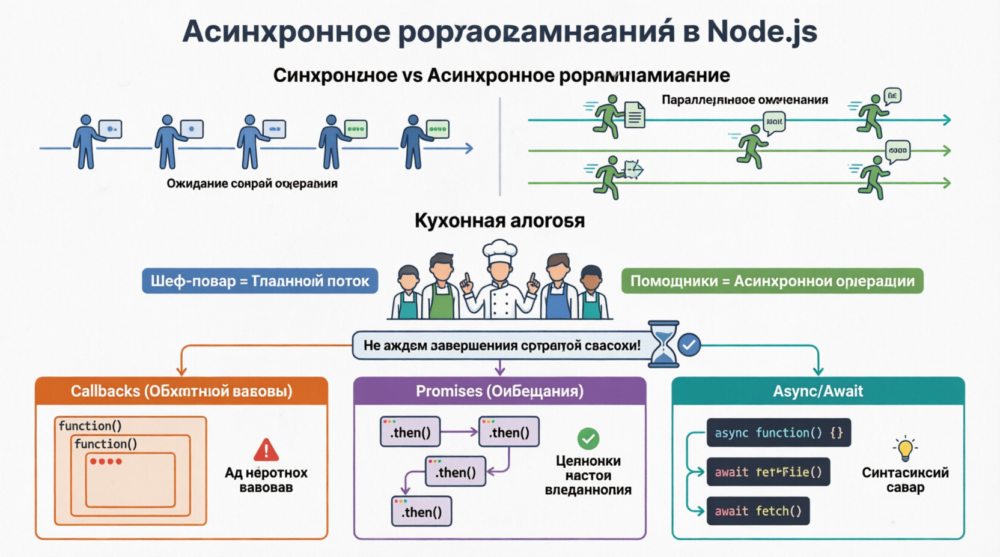

# Asynchronous Programming in Node.js
В основе Node.js лежит AСИНХРОННОЕ ПРОГРАММИРОВАНИЕ, позволяющее выполнять несколько операций одновременно, не дожидаясь завершения одной, прежде чем запускать другую. Этот подход имеет решающее значение для создания высокопроизводительных масштабируемых приложений, особенно тех, которые требуют взаимодействия в режиме реального времени. Давайте углубимся в концепцию асинхронного программирования, поймем, как это работает в Node.js и исследуем его значение в экосистеме Node.js.

## The Importance of Asynchronous Programming
В ТРАДИЦИОННОМ СИНХРОННОМ программировании операции выполняются последовательно, и каждая операция должна дождаться завершения предыдущей, прежде чем переходить к следующей. Это может привести к неэффективности и ухудшению взаимодействия с пользователем, особенно при выполнении задач, связанных с вводом-выводом, таких как чтение файлов, запросы к базам данных или выполнение сетевых запросов. Асинхронное программирование, с другой стороны, позволяет выполнять несколько операций одновременно, что значительно повышает эффективность и оперативность реагирования приложений.

Асинхронное программирование в Node.js позволяет писать код, который не требует ожидания завершения медленных операций. Представьте, что вы шеф-повар (да, еще одна кухонная аналогия!), который начинает готовить сложное блюдо. Вместо того чтобы ждать завершения каждого этапа, вы делегируете задачи своим помощникам (обратные вызовы, обещания и асинхронное ожидание) и переходите к следующему заданию. Таким образом, все блюдо готовится намного быстрее. Node.js синтаксис async/await позволяет асинхронному коду выглядеть и вести себя почти как синхронный код, что упрощает его чтение и обслуживание.

#### Callbacks
САМЫЙ простой И традиционный способ обработки асинхронных операций в Node.js - это Callbacks. Callbacks - это функция, передаваемая в качестве аргумента другой функции, которая затем выполняется после завершения асинхронной операции.

#### Promises
Несмотря на то, что Callbacks просты и эффективны, они могут привести к "аду обратного вызова" или "пирамиде гибели" при работе с несколькими вложенными асинхронными операциями. Promises предоставляют более ***понятный и управляемый способ обработки асинхронного кода***. Обещание представляет собой конечное завершение (или сбой) асинхронной операции и позволяет объединить несколько операций в цепочку.

#### Async/Await
Функция ASYNC/AWAIT, ПРЕДСТАВЛЕННАЯ в ECMAScript 2017 (ES8), обеспечивает ***синтаксический сахар*** над promises, благодаря чему асинхронный код выглядит и ведет себя как синхронный код. Это помогает при написании более чистого и удобочитаемого асинхронного кода.

Асинхронное программирование - это мощная парадигма, которая позволяет Node.js выполнять несколько операций одновременно, что делает его высокоэффективным и масштабируемым. Понимание и эффективное использование методов асинхронного программирования, таких как обратные вызовы, обещания и асинхронное ожидание, необходимы для создания надежных и производительных приложений в Node.js. Освоив эти концепции, вы сможете писать более чистый и удобный в обслуживании код и создавать приложения, которые будут соответствовать требованиям современной веб-разработки. Разрабатываете ли вы веб-серверы, APL или приложения реального времени, асинхронное программирование в Node.js обеспечивает основу для создания высокочувствительных и масштабируемых решений.