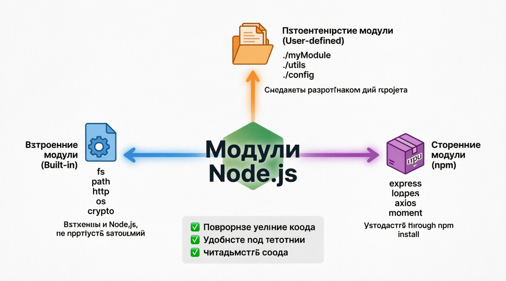
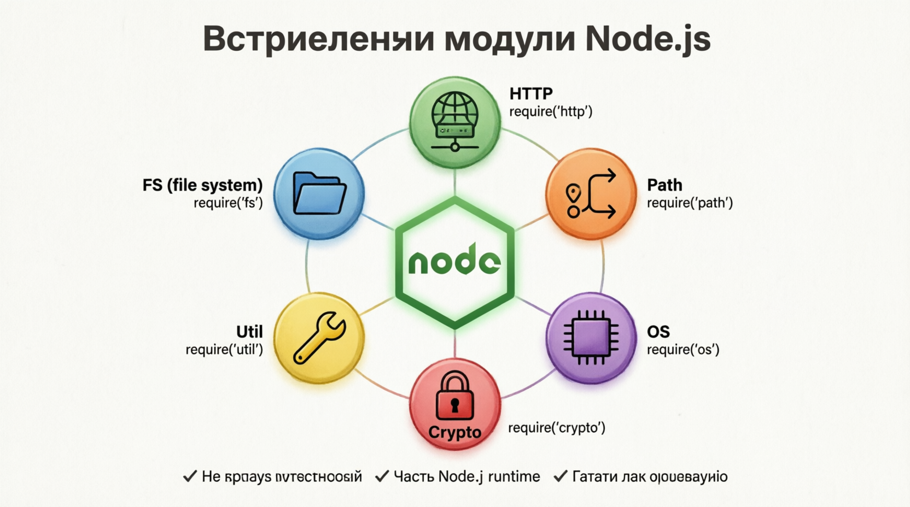
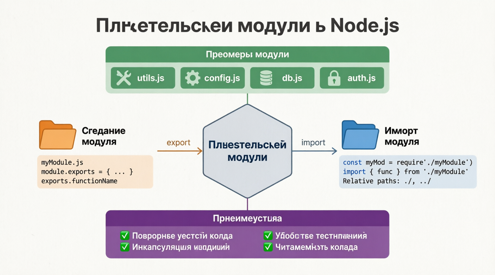
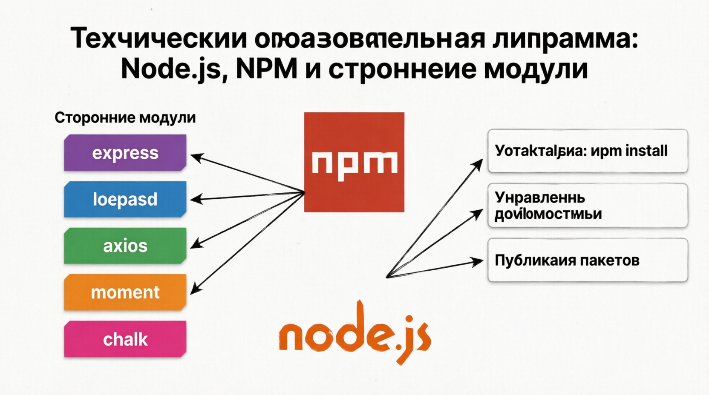

# Node.js Modules and NPM
NODE.JS МОДУЛИ И Node Package Manager (NPM) являются неотъемлемой частью экосистемы Node.js. Они позволяют разработчикам структурировать свои приложения по модульному принципу и эффективно управлять зависимостями. Понимание того, как использовать модули и NPM, важно для любого разработчика Node.js.

## Node.js Modules
Модули В NODE.JS помогают разбивать код на более мелкие, пригодные для повторного использования фрагменты. Такой модульный подход делает кодовую базу более удобной в обслуживании и понятной. Node.js поддерживается три типа модулей: ***встроенные (built-in) модули, пользовательские (user-defined) модули и модули сторонних производителей (npm)***

#### Built-in Modules
NODE.JS ПОСТАВЛЯЕТСЯ С набором встроенных модулей, обеспечивающих различные функциональные возможности, такие как операции с файловой системой, HTTP-серверы и утилиты. Эти модули являются частью среды выполнения Node.js и не требуют установки.

#### User-defined Modules
USER-ОПРЕДЕЛЕННЫЕ МОДУЛИ - это пользовательские модули, созданные разработчиками для инкапсуляции определенных функциональных возможностей. Эти модули можно экспортировать и импортировать в другие части приложения.

#### Third-party Modules
СТОРОННИЕ МОДУЛИ - это модули, созданные сообществом и распространяемые через NPM. Они предоставляют широкий спектр функциональных возможностей, от библиотек утилит до полноценных фреймворков.

#### Node Package Manager (NPM)
NPM - ЭТО МОЩНЫЙ ИНСТРУМЕНТ, который поставляется ***в комплекте*** с Node.js. Он позволяет разработчикам управлять зависимостями проекта, устанавливать сторонние модули и делиться своими собственными модулями с сообществом. NPM упрощает включение внешних библиотек и инструментов в ваши Node.js проекты.

NPM (Node Package Manager) - крупнейший реестр программного обеспечения в мире, в котором доступно более миллиона пакетов!
Эта обширная экосистема означает, что, скорее всего, найдется пакет практически для всего , что вы можете себе представить. Нужна библиотека для обработки дат? Попробуйте moment. Хотите создать экспресс -сервер? Установите express. Интересный факт: инцидент с "левым блоком" в 2016 году, когда из NPM была удалена крошечная утилита , привел к остановке тысяч проектов по всему миру, продемонстрировав, насколько взаимосвязана экосистема Node.js.

Понимание Node.js модулей и NPM важно для любого Node.js разработчика. Модули помогают вам разбивать ваш код на многоразовые фрагменты, будь то встроенные, пользовательские или сторонние. NPM упрощает управление зависимостями, позволяя вам без особых усилий внедрять обширную экосистему пакетов в ваши проекты. Освоение модулей и npm, вы можете написать более чистого и поддерживаемого кода и использовать возможности сообщества Node.js для создания надежных и масштабируемых приложений.