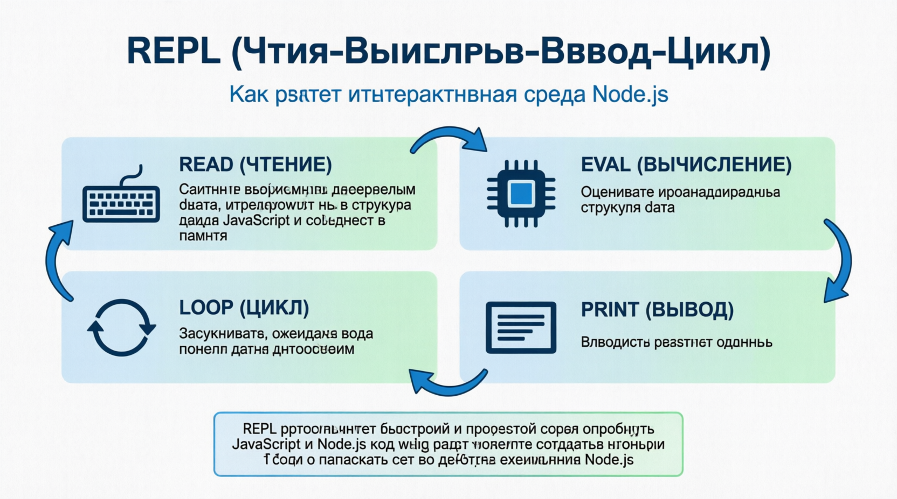

# Using the REPL (Read-Eval-Print Loop)
REPL (цикл ЧТЕНИЯ-оценки -печати) - это интерактивная оболочка, которая поставляется с Node.js. Она позволяет выполнять код JavaScript построчно и сразу же видеть результаты. Этот инструмент невероятно полезен для тестирования, отладки и экспериментов с JavaScript и Node.js кодом.

Node.js REPL - это не просто интерактивная оболочка, это мощная игровая площадка для экспериментов с кодом. Вы можете использовать его для тестирования фрагментов, отладки кода и даже загрузки и сохранения скриптов. Это похоже на лабораторию, где вы можете поработать со своим идеями и увидеть немедленные результаты. Кроме того, в REPL есть несколько скрытых преимуществ: type .ознакомьтесь со всеми специальными командами, которые он поддерживает, и вы обнаружите, что он содержит множество функций, которые могут сделать ваши занятия программированием более эффективными и увлекательными. Например, знаете ли вы, что можете сохранить весь свой REPL запись сеанса в файл с помощью .сохраните и загрузите его позже с помощью .load? Это удобный способ сохранить ваши эксперименты!

## What is REPL?

#### THE REPL STANDS FOR:
| Include  | Description |
| ------------- |:-------------:|
| Read     | Он считывает вводимые пользователем данные, преобразует их в структуры данных JavaScript и сохраняет в памяти.    |
| Eval       | Он оценивает проанализированную структуру данных.     |
| Print      | Он выводит результат оценки.     |
| Loop     | Он зацикливается, ожидая ввода новых данных пользователем.     |

REPL предоставляет быстрый и простой способ опробовать JavaScript и Node.js код без необходимости создавать новый файл и запускать его во время выполнения Node.js.

## Accessing REPL History
Программа REPL ХРАНИТ ИСТОРИЮ введенных вами команд. Вы можете перемещаться по истории с помощью клавиш со стрелками вверх и вниз, что упрощает повторный запуск предыдущих команд или внесение небольших изменений.

## Underscore Variable
REPL АВТОМАТИЧЕСКИ присваивает результат последнего вычисленного выражения переменной со знаком подчеркивания ( _ ), позволяя вам использовать его в последующих командах.

Программа Node.js REPL - это мощный инструмент для экспериментов с JavaScript и Node.js интерактивным написанием кода. Он позволяет быстро тестировать фрагменты кода, отлаживать код и изучать Node.js API без необходимости создавать и запускать отдельные файлы. Понимая и используя возможности REPL, вы можете значительно улучшить свой рабочий процесс разработки и повысить производительность.