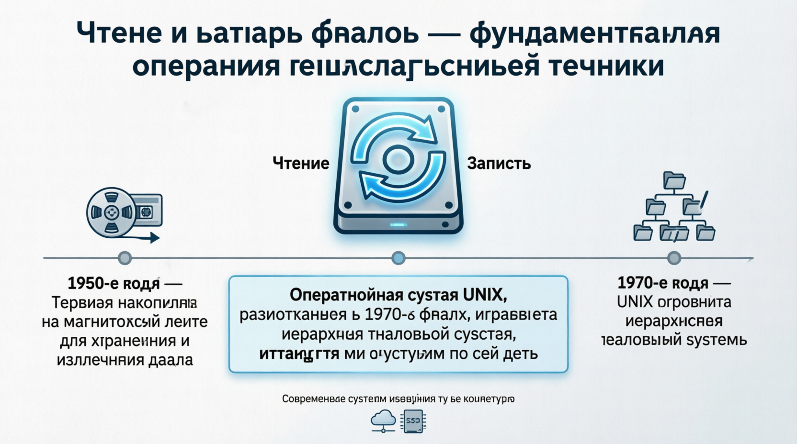
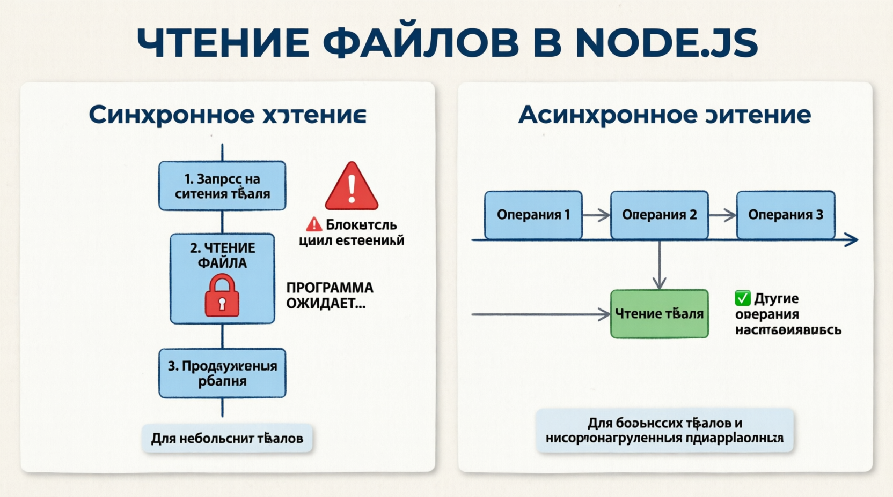

# Reading and Writing Files
Обработка файлов является фундаментальным аспектом многих приложений. Независимо от того, читаете ли вы файлы конфигурации, записываете журналы или обрабатываете данные, понимание того, как ***эффективно читать и записывать файлы*** в Node.js, имеет решающее значение. Node.js предоставляет модуль fs, который предлагает как синхронные, так и асинхронные методы взаимодействия с файловой системой. Давайте подробнее рассмотрим эти концепции.

Чтение и запись файлов в это одна из самых фундаментальных операций в вычислительной технике. Концепция работы с файлами возникла на заре вычислительной техники в 1950-х годах, когда были представлены первые накопители на магнитной ленте для хранения и извлечения данных. Перенесемся в сегодняшний день и Node.js предлагаем мощные, неблокирующие операции с файловой системой, которые позволяют легко обрабатывать гигабайты данных.

Интересный факт: Операционная система UNIX, разработанная в 1970-х годах, представила иерархию файловой системы, которую мы используем по сей день. Node.js модуль fs создан для легкой работы с этим структура, позволяющая разработчикам с легкостью выполнять сложные операции с файлами. Кроме того, эффективность Node.js при чтении и записи файлов настолько высока, что позволяет таким крупным приложениям, как Netflix, предоставлять потоковый контент миллионам пользователей одновременно.



## Introduction to the fs Module
Модуль fs (файловая система) Node.js позволяет взаимодействовать с файловой системой вашего компьютера. С его помощью можно читать, записывать, обновлять, удалять файлы и каталоги, а также управлять ими. Модуль fs можно импортировать с помощью:

```
const fs = требуется ('fs');
```

## Reading Files
ЧТЕНИЕ ФАЙЛОВ МОЖЕТ осуществляться двумя способами: синхронно и асинхронно.

#### Synchronous Reading
При СИНХРОННОМ ЧТЕНИИ выполнение программы приостанавливается до завершения операции чтения файла. Это может быть несложно для небольших файлов или простых скриптов, но может заблокировать цикл обработки событий для больших файлов или более сложных приложений.

#### Asynchronous Reading
AСИНХРОННОЕ ЧТЕНИЕ позволяет ***выполнять другие операции*** во время чтения файла, что делает его более подходящим для работы с файлами большего размера и высокопроизводительными приложениями.


## Writing Files
Запись В ФАЙЛЫ также МОЖЕТ выполняться синхронно или асинхронно.

## Appending to Files
Иногда вам может потребоваться добавить данные в существующий файл, а не перезаписывать его. Для этой цели используются методы ```fs.appendFile``` и ```fs.appendFileSync```.

## Deleting Files
Чтобы УДАЛИТЬ ФАЙЛЫ, ВЫ можете использовать методы ```fs.unlink``` и ```fs.unlinkSync```.

## Watching Files for Changes
N ODE.JS ПОЗВОЛЯЕТ ОТСЛЕЖИВАТЬ изменения в файле или каталоге, что полезно для реализации таких функций, как оперативная перезагрузка в средах разработки.

Чтение и запись файлов в Node.js благодаря модулю fs становятся простыми и эффективными. Выбор синхронных или асинхронных методов зависит от конкретных потребностей вашего приложения. Синхронные методы просты, но могут блокировать цикл обработки событий, в то время как асинхронные методы не являются блокирующими и лучше подходят для приложений, критически важных для производительности. Понимая и используя эти возможности, вы сможете эффективно управлять файловыми операциями в своих проектах Node.js.