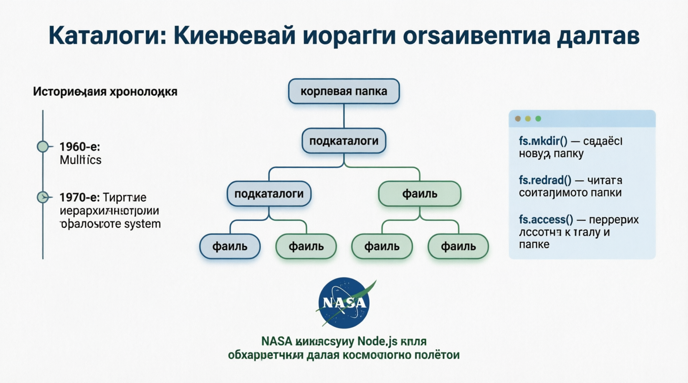

# Working with Directories
Общие КАТАЛОГИ НЕОБХОДИМЫ для ***организации файлов в файловой системе***. Node.js Модуль fs предоставляет надежный набор методов для создания, чтения, обновления и удаления каталогов. Понимание того, как работать с каталогами, имеет решающее значение для эффективного управления файловой структурой вашего приложения.

## Creating Directories
Для СОЗДАНИЯ КАТАЛОГОВ Node.js предлагаются как синхронные, так и асинхронные методы.

#### Synchronous Directory Creation
```
const fs = require('fs');

try {
    if (!fs.existsSync('new-directory')) {
        fs.mkdirSync('new-directory');
        console.log('Directory created successfully');
    } else {
        console.log('Directory already exists');
    }
} catch (err) {
    console.error('Error creating directory:', err);
}
```
В этом примере:
```fs.existsSync('new-directory')``` проверяет, существует ли каталог ранее.
```fs.mkdirSync('new-directory')``` создает каталог, если он не существует.

Ошибки перехватываются и регистрируются в консоли.

#### Asynchronous Directory Creation
```
const fs = require('fs');

fs.mkdir('new-directory', (err) => {
    if (err) {
        return console.error('Error creating directory:', err);
    }
    console.log('Directory created successfully');
});

console.log('Creating directory...');
```

В этом примере:

```fs.mkdir('new-directory', обратный вызов)``` создает каталог асинхронно.
Функция обратного вызова обрабатывает любые ошибки.
Сообщение "Создание каталога..." регистрируется немедленно, демонстрируя неблокирующее поведение.

Каталоги, или папки, как их обычно называют, являются ***ключевой частью организации данных в любой компьютерной системе***. Идея иерархических файловых систем, в которых каталоги могут содержать подкаталоги, была впервые представлена в 1960-х годах в ранних операционных системах, таких как Multics. Это нововведение позволило более эффективно организовать данные и осуществлять поиск. Сегодня Node.js программно управлять каталогами невероятно просто. Например, всего с помощью нескольких строк кода вы можете создавать сложные структуры каталогов, на настройку которых вручную ушло бы гораздо больше времени. Более того, такие компании, как NASA, используют системы управления каталогами на базе Node.js для обработки огромных объемов данных, полученных в ходе космических полетов, демонстрируя надежность и масштабируемость Node.js в управлении каталогами.


## Reading, Deleting, Renaming Directories
Может выполняться синхронно или асинхронно для списка файлов и подкаталогов.

## Watching Directories
NODE.JS МОЖЕТ ОТСЛЕЖИВАТЬ изменения в каталоге, такие как добавление, удаление или модификация файлов.

## Рекомендации по использованию
***Проверьте наличие каталога***: перед созданием каталога проверьте, существует ли он уже, используя fs.existsSync, или обработайте ошибку, если используются асинхронные методы, чтобы избежать конфликтов.
***Используйте параметр Recursive***: При создании вложенных каталогов используйте параметр recursive: true в fs.mkdir или fs.mkdirSync, чтобы создать все
необходимые родительские каталоги.
***Обработка ошибок***: Всегда обрабатывайте ошибки надлежащим образом при выполнении операций с каталогами (создание, чтение, удаление), чтобы ваше приложение могло реагировать на непредвиденные ситуации.
***Используйте модуль Path***: Используйте модуль path для обработки файлов и манипулирования ими и надежные пути к каталогам в разных операционных системах.

Модуль fs упрощает работу с каталогами в Node.js. Вы можете создавать, читать, переименовывать, удалять и отслеживать каталоги, используя как синхронные, так и асинхронные методы. В то время как синхронные методы просты и удобны в использовании, асинхронные методы предпочтительнее для приложений, требующих высокой производительности, поскольку они не блокируют цикл обработки событий. Понимание этих операций позволит вам эффективно управлять файловой структурой вашего приложения, обеспечивая плавную и результативную работу с каталогами.