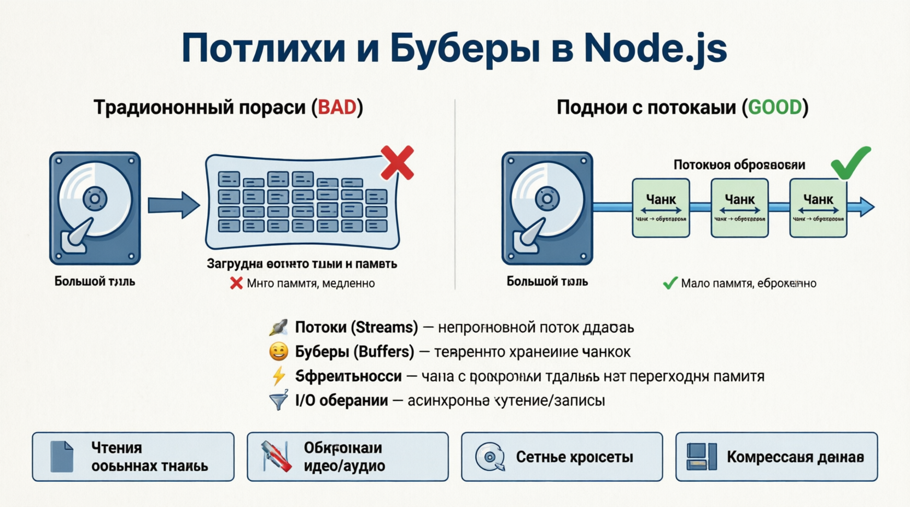
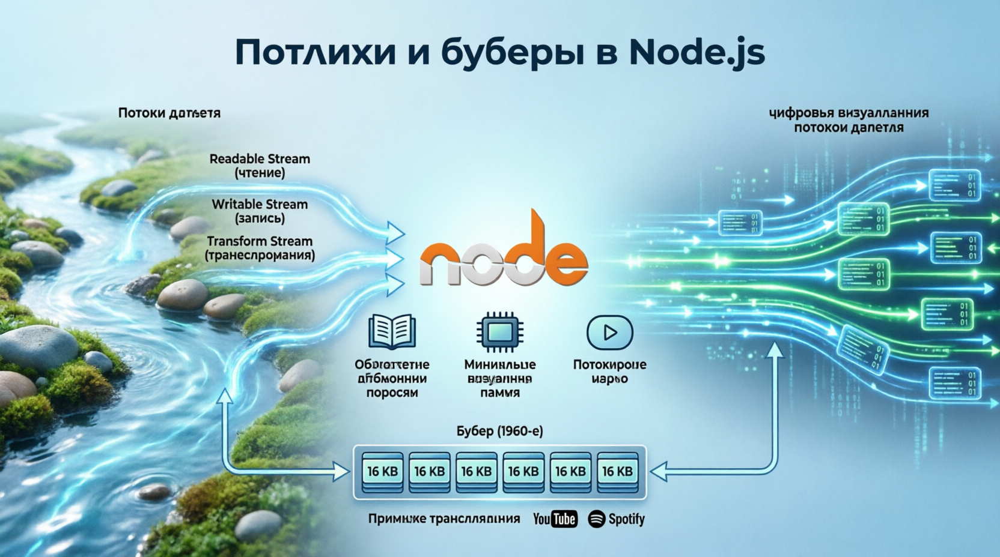
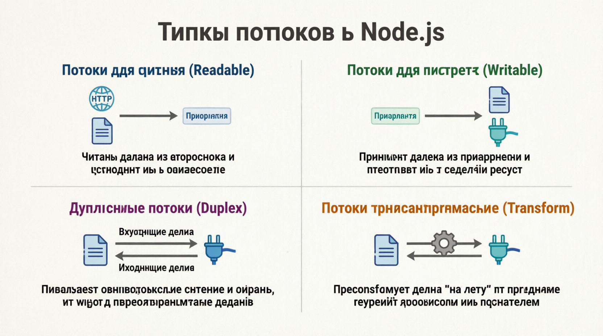
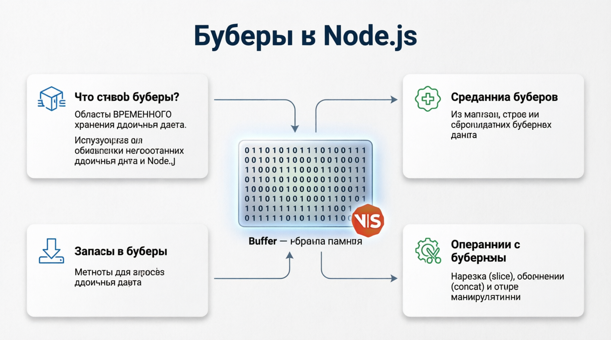

# Streams and Buffers
Потоки данных И БУФЕРЫ имеют основополагающее значение для эффективной обработки операций ввода-вывода в Node.js. Они обеспечивают ***непрерывное считывание и запись данных***, что позволяет работать ***с большими наборами данных или файлами, не загружая все данные в память одновременно***. Давайте углубимся в эти концепции, чтобы понять их роль и то, как эффективно их использовать.

Концепция потоков в вычислительной технике была вдохновлена ***непрерывным течением воды в реках и ручьях***, что является мощной метафорой для обработки данных. Потоки в Node.js позволяют эффективно обрабатывать большие массивы данных, разбивая их на более мелкие фрагменты. Эта идея стала особенно актуальной с появлением Интернета и необходимостью эффективной обработки больших объемов данных. Node.js streams настолько мощны, что могут обрабатывать потоковое видео в реальном времени, загружать большие файлы и прямые трансляции данных с минимальным использованием памяти. Еще один интересный факт: буфер концепция была впервые представлена в 1960-х годах для управления данными, передаваемыми между различными частями компьютерной системы. В Node.js Буферы обрабатывают двоичные данные, что позволяет быстро и эффективно обрабатывать файлы и потоки. Эти инновации лежат в основе таких высокопроизводительных приложений, как YouTube и Spotify, которые используют потоковую передачу и буферизацию для доставки контента миллионам пользователей по всему миру.

## Understanding Streams
Потоки ДАННЫХ - ЭТО ОБЪЕКТЫ в Node.js, которые позволяют считывать данные из источника или записывать данные в пункт назначения последовательным образом. Они предоставляют способ обработки данных по частям, что имеет решающее значение для производительности и управления памятью.

### Types of Streams
| Types of Streams  | Description |
| ------------- |:-------------:|
| Readable Streams     | Используется для считывания данных из источника.    |
| Writable Streams        | Используется для записи данных в пункт назначения.    |
| Duplex Streams     | Может как считывать, так и записывать данные.    |
| Transform Streams     | Дуплексные потоки, которые могут изменять или преобразовывать данные по мере их чтения или записи.     |

#### Readable Streams
ДОСТУПНЫЕ для чтения ПОТОКИ ПОЗВОЛЯЮТ считывать данные из источника, такого как файл или HTTP-ответ.

#### Writable Streams
ДОСТУПНЫЕ ПОТОКИ ПОЗВОЛЯЮТ записывать данные в пункт назначения, например в файл или сетевой сокет.

#### Duplex Streams
Потоки DUPLEX МОГУТ выполнять как операции чтения, так и записи, что делает их полезными для сетевых коммуникаций и аналогичных задач.

#### Transform Streams
ФОРМАТНЫЕ ПОТОКИ - ЭТО двусторонние потоки, которые могут изменять или преобразовывать данные по мере их чтения или записи. Они особенно полезны для таких задач, как сжатие и шифрование данных.

## Understanding Buffers
Буферы - ЭТО области ВРЕМЕННОГО хранения двоичных данных. В Node.js Буферы используются для обработки необработанных двоичных данных, что делает их незаменимыми для работы с потоками и других операций ввода-вывода.

#### Creating Buffers
ПРЕДЛОЖЕНИЯ МОГУТ БЫТЬ СОЗДАНЫ из различных источников, таких как массивы, строки или существующие буферные данные.

#### Writing to Buffers
ПОСТАВЩИКИ ПРЕДОСТАВЛЯЮТ МЕТОДЫ для записи двоичных данных.

#### Buffer Operations
ПОСТАВЩИКИ ПОДДЕРЖИВАЮТ РАЗЛИЧНЫЕ операции по манипулированию двоичными данными, такие как нарезка и объединение.

## Streams vs Buffers в Node.js

## Practical Applications of Streams and Buffers
Потоки данных И БУФЕРЫ используются в различных реальных приложениях, таких как:

#### File Processing:
- Чтение и запись больших файлов без их полной загрузки в память.
- Пример: Обработка файлов журналов или медиафайлов.
#### Network Communication:
- Эффективное управление передачей данных по сетям.
- Пример: Создание HTTP-серверов, TCP-серверов или WebSocket-серверов.
#### Data Transformation:
- Изменение данных по мере их чтения или записи, например, сжатие или шифрование.
- Пример: Сжатие файлов с помощью gzip или шифрование потоков данных.
#### Real-time Data Processing:
- Обработка потоков данных в режиме реального времени, таких как потоковое видео или аналитика в режиме реального времени.
- Пример: Обработка видеопотоков для прямой трансляции.

## Best Practices
***Используйте Pipe для создания цепочки:*** используйте метод pipe для эффективного соединения потоков, доступных для чтения и записи, который автоматически регулирует обратное давление и обеспечивает бесперебойный поток данных.
***Обработка событий потока:*** Отслеживайте важные события потока (данные, завершение, ошибка, финиш), чтобы эффективно управлять жизненным циклом потока и обрабатывать любые возможные ошибки.
***Разумно используйте буферы:*** используйте буферы для обработки двоичных данных, таких как чтение из двоичных файлов или запись в них, и убедитесь, что размеры буфера оптимизированы для конкретного случая использования, чтобы сбалансировать производительность и использование памяти.
***Очистка ресурсов:*** Всегда выполняйте очистку ресурсов, например, закрывайте потоки с помощью stream.close() или stream.destroy(), чтобы предотвратить утечки памяти и обеспечить эффективное управление ресурсами.

ПОТОКИ ДАННЫХ И БУФЕРЫ являются мощными инструментами в Node.js для эффективной обработки операций ввода-вывода. Потоки позволяют обрабатывать данные по частям, что делает их идеальными для работы с большими наборами данных или файлами. Буферы позволяют вам напрямую манипулировать двоичными данными, обеспечивая основу для работы с потоками. Овладев этими понятиями, вы можете создавать надежные приложения, которые эффективно обрабатывать данные и проводить под нагрузкой. Если вы находитесь обработки файлов, общение по сети, или преобразование данных в режиме реального времени, потоки и буферы являются важными компонентами свой Node.js инструментарий.