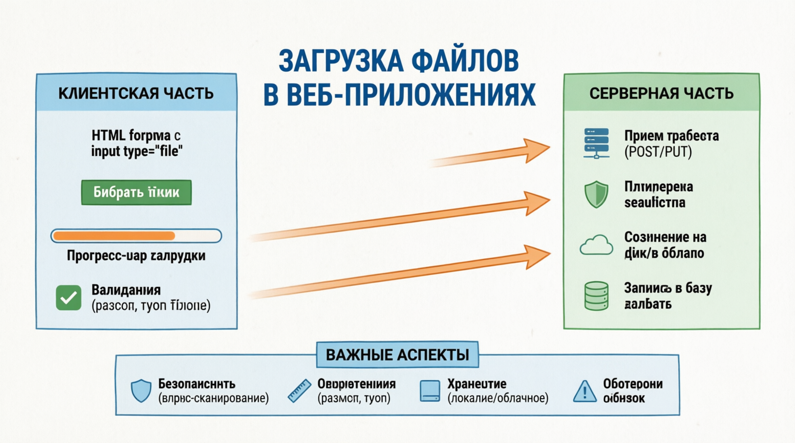

# Handling File Uploads
ЗАГРУЗКA ФАЙЛОВ является распространенным требованием в веб-приложениях. Node.js для упрощения этого процесса предусмотрены ***различные инструменты*** и библиотеки. Одной из самых популярных библиотек для обработки загрузки файлов в Node.js является multer. 

Возможность загружать файлы через Интернет произвела революцию в том, как мы делимся данными и управляем ими. Первый протокол передачи файлов (FTP) был разработан в начале 1970-х годов, заложив основу для современных систем загрузки файлов. Сегодня, Node.js с помощью такого промежуточного программного обеспечения, как multer, обработка загрузки файлов становится невероятно эффективной и простой. Эта технология имеет решающее значение для различных применений, начиная от простых -от систем управления документами до сложных облачных сервисов хранения данных. Замечательным примером технологии загрузки файлов является Dropbox, который начинался как простой инструмент синхронизации файлов и превратился в крупного поставщика облачных хранилищ, ежедневно обрабатывающего миллиарды загружаемых файлов. Node.js способность устройства эффективно обрабатывать загрузку файлов означает, что оно может использоваться в приложениях с высокими требованиями к надежности и скорости, таких как инструменты для совместной работы в режиме реального времени и платформы социальных сетей, где пользователи ежесекундно загружают огромные объемы данных.

## Best Practices
***Проверка типов файлов***: Реализуйте проверку файлов, чтобы гарантировать загрузку только нужных типов файлов, предотвращая потенциальные угрозы безопасности и обеспечивая целостность вашего приложения.
***Ограничьте размер файла:*** Установите ограничения на размер файла, чтобы предотвратить загрузку слишком больших файлов, которые могут вызвать проблемы с производительностью и истощить ресурсы сервера.
***Используйте безопасные пути:*** храните загруженные файлы в защищенных, непубличных каталогах и используйте уникальные имена файлов или имена файлов на основе хэша для предотвращения конфликтов и потенциальных проблем с безопасностью.
***Корректно обрабатывайте ошибки:*** реализуйте надежную обработку ошибок, чтобы устраняйте любые проблемы, возникающие в процессе загрузки файлов, такие как неподдерживаемые типы файлов, превышение предельного размера файла или сетевые ошибки.

Обработка нескольких загрузок файлов в multer middleware Node.js проста. Понимание этих концепций имеет решающее значение для создания веб-приложений, которым требуются надежные возможности обработки файлов, гарантирующие безопасное и эффективное управление загрузкой файлов.