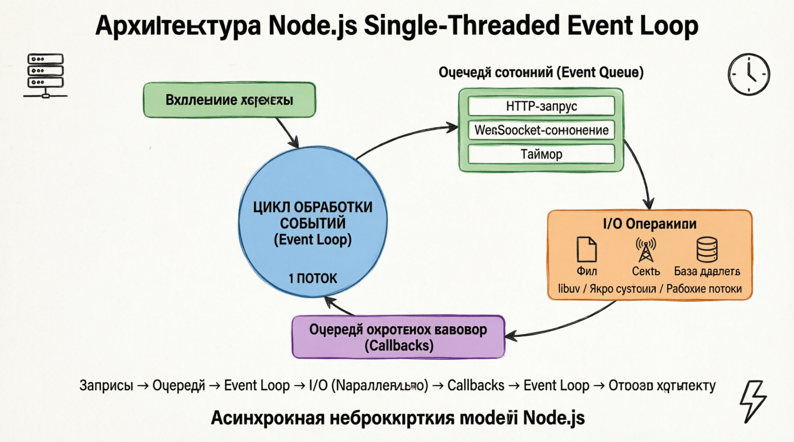
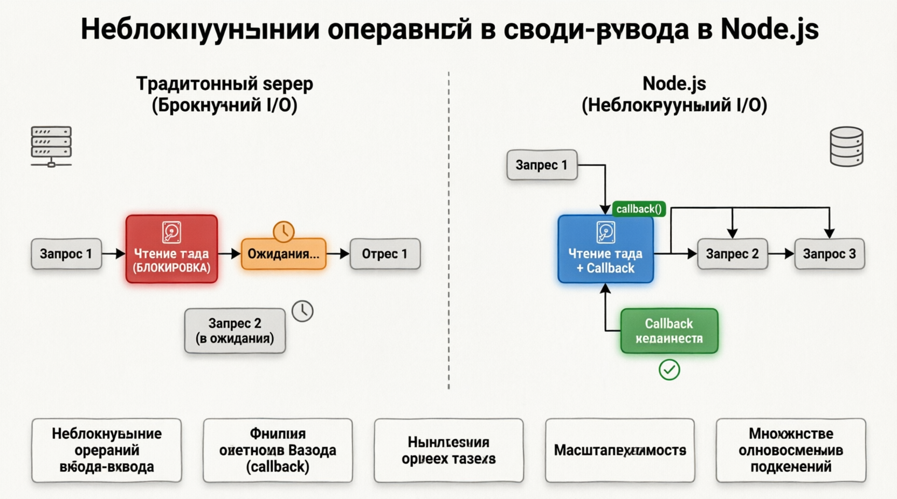
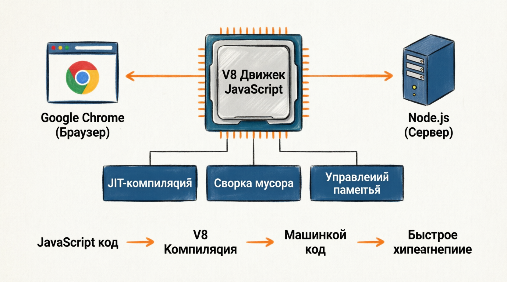
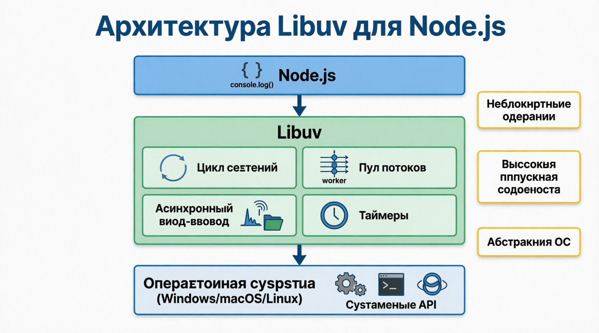
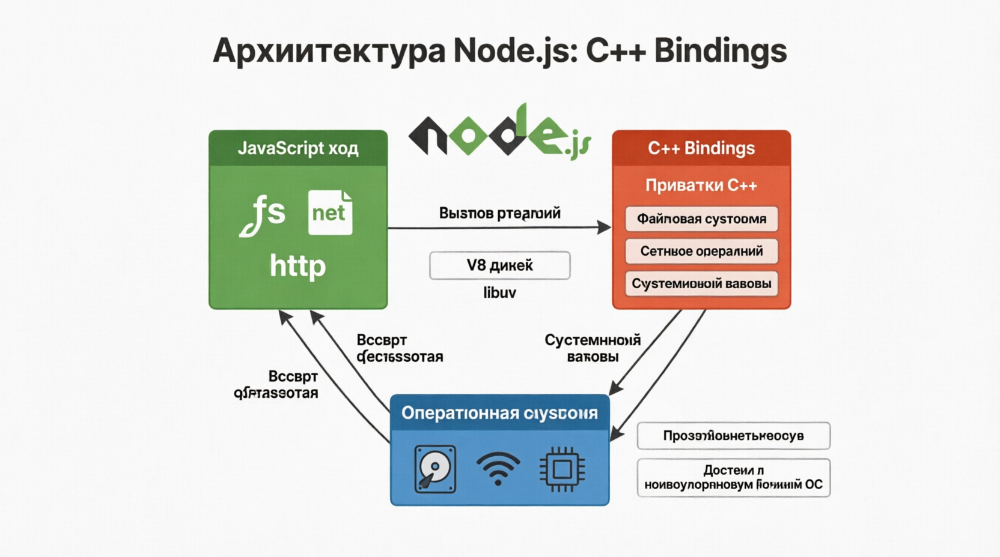
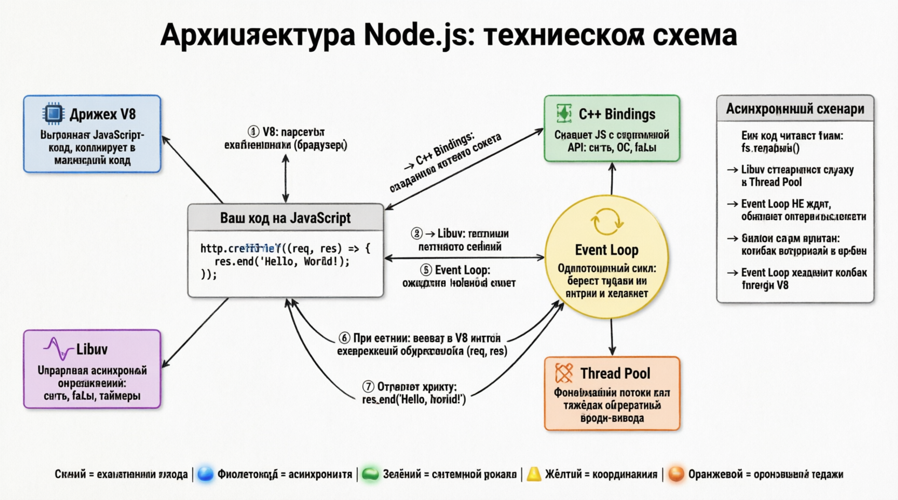

# Node.js Architecture
Понмиание архитектуры Node.js необходимо для того, чтобы оценить ее преимущества в производительности и масштабируемости. Node.js она предназначена для создания ***масштабируемых сетевых приложений***, и ее архитектура играет решающую роль в достижении этой цели. Архитектура Node.js может быть разделена на следующие основные компоненты:

- Single-Threaded Event Loop
- Non-Blocking I/O
- V8 JavaScript Engine
- Libuv
- C++ Bindings

## Single-Threaded Event Loop
В основе node.js лежит ***однопоточный цикл обработки событий***. В отличие от традиционных веб-серверов, которые создают новый поток для каждого запроса клиента, Node.js для обработки всех входящих запросов используется ***один поток***. На первый взгляд такая однопоточность может показаться ограничением, но на самом деле это одна из сильных сторон Node.js. Цикл обработки событий работает в ***асинхронной, неблокирующей парадигме***, позволяя Node.js эффективно обрабатывать множество одновременных подключений без дополнительных затрат на управление несколькими потоками.

## Цикл обработки событий работает следующим образом:

#### Входящие запросы:
Когда поступает запрос, Node.js помещает его в очередь событий.

#### Обработка цикла обработки событий:
Цикл обработки событий постоянно ***проверяет очередь событий на наличие новых запросов***. Он обрабатывает каждый запрос, выполняя соответствующие функции обратного вызова.

#### I/O Operations:
Если запрос включает ***операции ввода-вывода***, такие как чтение из файла или отправка сетевого запроса, Node.js эти задачи передаются ядру системы или рабочим потокам, предоставляемым библиотекой libuv. Цикл обработки событий не ожидает завершения этих операций. Вместо этого он продолжает обрабатывать другие запросы в очереди.

#### Callbacks:
Как только операции ввода-вывода завершены, обратные вызовы, связанные с этими операциями, ***добавляются в очередь событий***. Цикл обработки событий принимает их и выполняет, гарантируя, что приложение остается отзывчивым и эффективным.

Эта неблокирующая, управляемая событиями модель позволяет Node.js обрабатывать большое количество одновременных подключений с низкой задержкой, что делает ее идеальной для приложений реального времени, таких как чат-серверы, онлайн-игры и прямые трансляции.



Движок V8, который поддерживает Node.js, изначально был разработан Google для их браузера Chrome. Он предназначен для компиляции JavaScript непосредственно в машинный код, что обеспечивает молниеносное выполнение. Node.js использует V8 для выполнения JavaScript на стороне сервера с непревзойденной скоростью и производительностью. Кроме того, ***неблокирующая управляемая событиями*** архитектура Node.js была вдохновлена дизайном самих веб-браузеров, которым необходимо обрабатывать многие события (например, клики пользователя и сетевые реакции) асинхронно, чтобы оставаться отзывчивыми.

## Non-Blocking I/O
NODE.JS ***неблокирующие операции ввода-вывода*** являются неотъемлемой частью его архитектуры. В традиционных серверных средах операции ввода-вывода, такие как чтение файла или запрос к базе данных, блокируют выполнение программы до завершения операции. Такое поведение блокировки может привести к неэффективности и проблемам с масштабируемостью, особенно при обработке нескольких одновременных запросов.

Node.js с другой стороны, он использует неблокирующие операции ввода-вывода. Когда запускается операция ввода-вывода, Node.js не ожидает ее завершения. Вместо этого он ***регистрирует функцию обратного вызова и переходит к выполнению других задач***. После завершения операции ввода-вывода выполняется функция обратного вызова, позволяющая приложению обработать результат операции. Такой подход гарантирует, что приложение остается отзывчивым и может обрабатывать множество одновременных подключений, не перегружаясь из-за медленных операций ввода-вывода.



## Движок V8
Движок JAVASCRIPT V8, разработанный Google, является важнейшим компонентом Node.js. V8 компилирует код JavaScript непосредственно в машинный код, обеспечивая быстрое и эффективное выполнение. Изначально разработанный для браузера Google Chrome, V8 был адаптирован для использования на стороне сервера в Node.js.

Оптимизации производительности в V8, такие как JIT-компиляция, сборка мусора и эффективное управление памятью, способствуют повышению скорости и масштабируемости Node.js. Используя версию 8, Node.js вы можете выполнять JavaScript-код на скорости, близкой к обычной, что делает его мощной платформой для создания высокопроизводительных приложений.



## Libuv
LIBUV - ЭТО МНОГОПЛАТФОРМЕННАЯ библиотека поддержки, которая предоставляет Node.js возможности асинхронного ввода-вывода. Она отвечает за абстрагирование базовых механизмов операционной системы, позволяя Node.js выполнять неблокирующие операции ввода-вывода на разных платформах, включая Windows, macOS и различные Unix-подобные системы.

Libuv предоставляет следующие основные функциональные возможности:

#### Event Loop:
Механизм цикла обработки событий, который управляет выполнением функций обратного вызова в Node.js.

#### Thread Pool:
Пул рабочих потоков, которые обрабатывают операции с файловой системой, поиск в DNS и другие задачи, которые в противном случае блокировали бы цикл обработки событий.

#### Asynchronous I/O:
Неблокирующая файловая система и сетевые операции.

#### Timers:
Механизмы планирования и выполнения функций обратного вызова после заданной задержки.

Перенося блокирующие операции на рабочие потоки и используя асинхронный ввод-вывод, libuv гарантирует, что Node.js цикл обработки событий остается свободным для обработки входящих запросов, сохраняя высокую пропускную способность и оперативность реагирования.



#### C++ Bindings
NODE.JS архитектура системы также включает в себя привязки к C++, которые позволяют ей взаимодействовать с функциональными возможностями ***системы более низкого уровня и встроенными библиотеками***. Эти привязки позволяют Node.js выполнять критически важные для производительности операции и использовать существующие библиотеки C/C++, расширяя ее возможности за пределы чистого JavaScript.

Node.js модули, такие как модуль fs для работы с файловой системой и модуль net для создания сетей, реализованы с использованием привязок C++. Такой подход гарантирует, что эти модули могут эффективно работать и беспрепятственно взаимодействовать с базовой операционной системой.



## Practical Example: How the Architecture Works Together

Чтобы проиллюстрировать, как эти ***компоненты работают вместе***, давайте рассмотрим практический пример простого веб-сервера, построенного с помощью Node.js:

```
const http = require('http');
const PORT = 3000;
const HOST = 'localhost';

const server = http.createServer((req, res) => {
  // Обработка маршрута: главная страница
  if (req.method === 'GET' && req.url === '/') {
    res.writeHead(200, { 'Content-Type': 'text/plain; charset=utf-8' });
    res.end('Hello, World!\n');
    
  } else {
    res.writeHead(404, { 'Content-Type': 'text/plain; charset=utf-8' });
    res.end('Not Found\n');
  }
});

server.listen(PORT, HOST, () => {
  console.log(`🚀 Server running at http://${HOST}:${PORT}/`);
});

server.on('error', (err) => {
  console.error('❌ Server error:', err.message);
});
```

В этом примере:
- ***Single-Threaded Event Loop:*** Функция createServer настраивает HTTP-сервер, который прослушивает входящие запросы. Каждый запрос добавляется в очередь событий, и цикл обработки событий обрабатывает эти запросы один за другим.
- ***Non-Blocking I/O:*** Когда запрос получен, сервер обрабатывает его, не блокируя цикл обработки событий. Если были задействованы какие-либо операции ввода-вывода (например, чтение файла), они будут обрабатываться асинхронно, что позволит серверу оставаться отзывчивым.
- ***V8 Engine:*** Код JavaScript выполняется движком V8, что обеспечивает высокую производительность.
- ***Libuv:*** Любыми низкоуровневыми асинхронными операциями (например, обработкой сетевых подключений) управляет libuv, который абстрагирует детали, относящиеся к конкретной платформе.
- ***C++ Bindings:*** Модуль http внутренне использует привязки C++ для эффективной обработки сетевых запросов и ответов.

Node.js архитектура, характеризующаяся ***однопоточным циклом обработки событий, неблокирующим вводом-выводом, движком V8, библиотекой libuv и привязками C++***, позволяет создавать высокопроизводительные масштабируемые сетевые приложения. Понимание этих компонентов, разработчики могут использовать Node.js для создания эффективной и гибкой приложения, которые отвечают современным требованиям веб-разработки.

