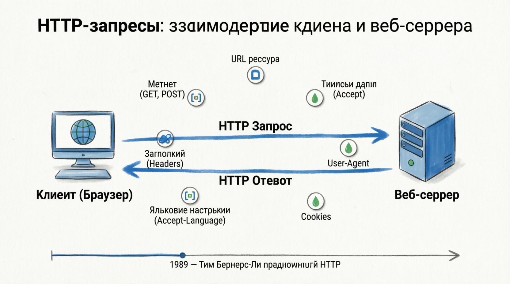

# Handling Different HTTP Methods
Методы HTTP ОПРЕДЕЛЯЮТ тип операции, запрашиваемой клиентом. Каждый метод имеет конкретное назначение и область применения. Понимание того, как обрабатывать различные методы HTTP в Node.js, имеет решающее значение для создания надежных и поддерживающих RESTful API.

Объект запроса на веб-серверах - это сокровищница информации. Он не только сообщает вам, какой ресурс запрашивается, но и предоставляет подробную информацию о клиенте, отправляющем запрос. Знаете ли вы, что HTTP (передача гипертекста Protocol), лежащий в основе цикла запроса/ответа, был предложен Тимом Бернерсом-Ли в 1989 году и с тех пор претерпел множество изменений для улучшения взаимодействия в Интернете? Понимание объекта запроса позволяет разработчикам адаптировать ответы на основе предпочтений клиента, таких как языки и форматы данных. Например, ваш языковые настройки браузера позволяют динамически определять язык содержимого веб-сайта.

#### Handling GET Requests
Общие запросы используются для получения данных с сервера. Они являются идемпотентными, то есть несколько идентичных запросов GET должны иметь тот же эффект, что и один запрос. Запросы GET не изменяют состояние сервера.

#### Handling POST Requests
Предварительные запросы используются для отправки данных на сервер для создания или обновления ресурса. Данные включаются в текст запроса.

#### Handling PUT Requests
Запросы PUT используются для обновления ресурса на сервере. Они также могут использоваться для создания ресурса, если он не существует. Запросы PUT обычно содержат данные в теле запроса.

#### Handling DELETE Requests
Запросы на удаление используются для удаления ресурса на сервере.

#### PATCH 
Используется для применения частичных изменений к ресурсу.

#### OPTIONS
Используется для описания вариантов взаимодействия с целевым ресурсом.